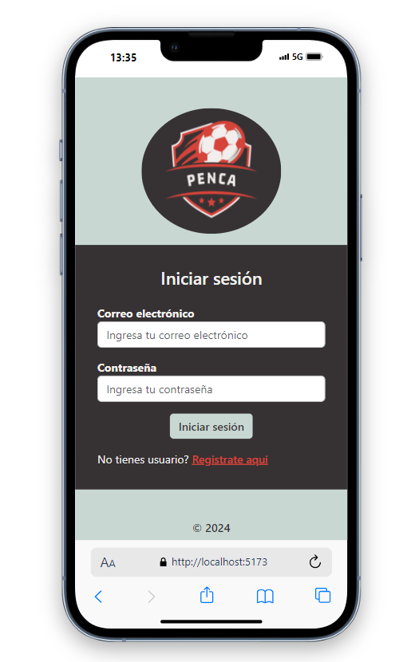
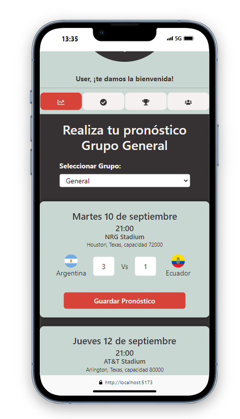
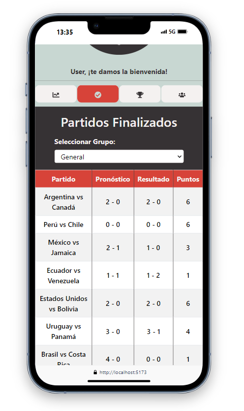
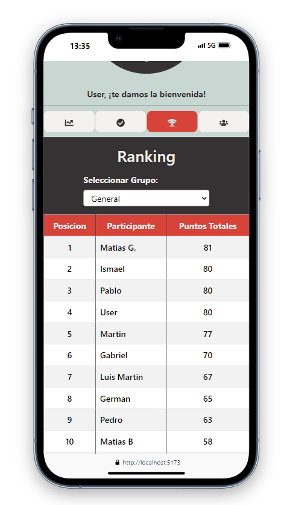
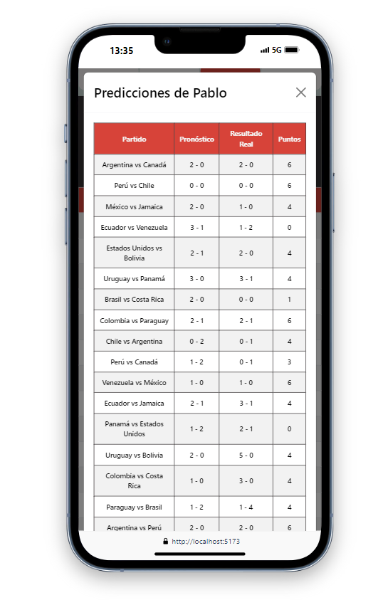
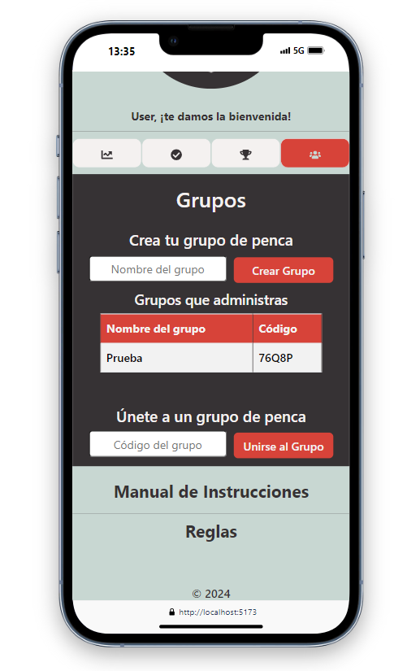

# Penca de Fútbol

## Descripción

La Penca de Fútbol es un proyecto personal desarrollado para practicar y profundizar los conocimientos adquiridos en el bootcamp de hackAcademy. Esta aplicación permite a los usuarios registrar pronósticos de partidos de fútbol, comparar sus predicciones con los resultados reales y ver los rankings de diferentes grupos.

## Características Principales

- **Registro y Acceso:** Regístrate y accede con tu correo electrónico y contraseña.
- **Pronósticos:** Haz predicciones para los partidos futuros y compáralas con los resultados reales.
- **Partidos Finalizados:** Consulta los resultados de los partidos que ya se han jugado.
- **Ranking:** Consulta el ranking de los usuarios en cada grupo y revisa los detalles de sus predicciones.
- **Grupos:** Visualiza y gestiona los grupos a los que estás unido o que has creado.

## Tecnologías y Frameworks

### Frontend

- **React**: Biblioteca de JavaScript para construir interfaces de usuario.
- **react-final-form**: Librería para el manejo de formularios.
- **CSS**: Hojas de estilo en cascada para el diseño.
- **Bootstrap**: Framework CSS para el diseño responsivo y componentes de interfaz de usuario.

### Backend

- **Node.js**: Entorno de ejecución de JavaScript en el servidor.
- **Express**: Framework para Node.js, facilita la creación de APIs.
- **MongoDB**: Base de datos NoSQL, almacena datos en documentos JSON.
- **Mongoose**: Librería de modelado de datos para MongoDB y Node.js.

### Autenticación

- **JWT (JSON Web Tokens)**: Para la autenticación de usuarios.

### Registro y Acceso

1. **Registro de Usuario:**

   - Dirígete a la página de registro.
   - Proporciona tu información básica, como nombre, correo electrónico y contraseña.
   - Una vez registrado, dirígete a la página de inicio de sesión para ingresar con tu correo electrónico y contraseña.

2. **Inicio de Sesión:**
   - Accede a la aplicación utilizando tu correo electrónico y contraseña.

### Navegación por la Aplicación

1. **Página Principal:**

   - Encontrarás cuatro pestañas principales: **Pronóstico**, **Partidos Finalizados**, **Ranking** y **Grupos**.

2. **Pronóstico:**

   - Aquí podrás hacer tus predicciones para los partidos futuros.
   - Selecciona el grupo en el que deseas realizar la predicción (por defecto, el grupo General).
   - Introduce el puntaje que crees que tendrá el equipo local y el visitante.
   - Haz clic en "Guardar Pronóstico" para registrar tus predicciones.
   - Se abrirá un modal de confirmación donde puedes decidir si deseas aplicar la predicción solo al grupo seleccionado o a todos los grupos.

3. **Partidos Finalizados:**

   - Consulta los resultados de los partidos que ya se han jugado.
   - Revisa los puntajes finales y compara tus predicciones con los resultados reales.

4. **Ranking:**

   - Consulta el ranking de los usuarios en cada grupo.
   - Al seleccionar un grupo, podrás ver el ranking actualizado de los usuarios y sus puntajes.
   - Al hacer clic en un usuario, se mostrará un modal con los detalles de sus predicciones y puntajes por partido.

5. **Grupos:**
   - Visualiza los grupos a los que estás unido o que has creado.

### Reglas y Puntuaciones

- Los puntos son calculados con el resultado de los 90 minutos más descuentos. No incluye prórroga ni penales.
- **Puntajes:**
  - Resultado Exacto: 6 puntos.
  - Acierto Ganador y acierto de goles de un equipo: 4 puntos.
  - Acierto Ganador o Empate sin acierto de goles: 3 puntos.
  - Acierto goles de un equipo: 1 punto.
  - No acierto de Ganador ni Empate y no acierto de goles de ningún equipo: 0 puntos.

## Capturas de Pantalla

